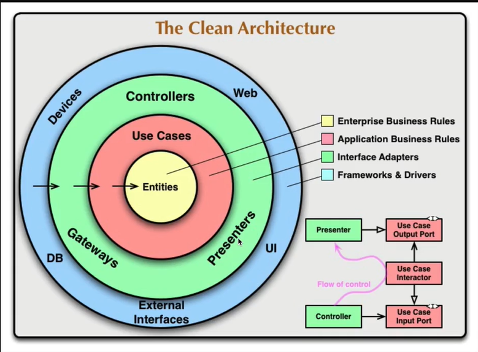

- Eu tenho que responder os alunos e eu me perco em quais dúvidas já foram respondidas

# insructor - use-case - students

- Entidades traduzem tudo que for mantido na aplicação - não precisa ser tablelas no banco - podem compor uma tabela

- implementada a interface de contrato da classe AnswersRepository, que é uma dependência externa da camada de persistência. Isso permitirá que a classe de caso de uso possa utilizá-la sem depender diretamente da implementação concreta da classe.

-Ha propriedades da entidade que podem ser consideradas entidades separadas que posuem funcionamento isoladas, no DDD a gente chama de value objec, ou seja, são valores são propriedades das nossas entidades que possuem regras de negócio associadas a essas propriedades e essas regras podem ser formatações validações, funcionamentos que eu quero restringir dentro daquela propriedade

- **Refatoração das Entidades com uma Classe Base (`Entity`)**

  As entidades de domínio (`Answer`, `Question`, `Student`, etc.) foram refatoradas para estender uma classe base genérica `Entity`.

  **Motivos para a mudança:**
  1.  **Centralização da Lógica de ID:** A criação e o gerenciamento de IDs únicos agora são feitos pela classe `Entity`, evitando duplicação de código.
  2.  **Encapsulamento:** As propriedades de cada entidade são agrupadas em um objeto `props` protegido, permitindo um controle de acesso mais rígido através de getters e métodos. Isso protege as regras de negócio da entidade.
  3.  **Manutenibilidade:** A lógica comum fica em um só lugar. Futuras alterações na gestão de IDs, por exemplo, só precisam ser feitas na classe `Entity`.

  

  Quando a gente fala sobre Design Software ou DDD, Domain Driven Design, isso é especificamente em como a gente vai converter um problema da vida real em um pedaço de software, em um projeto, uma aplicação. Enquanto DDD não tem nada a ver com como a gente vai implementar a nossa aplicação, a arquitetura de software tem totalmente relação em como a gente vai implementar o código da nossa aplicação.

  É claro que Clean Architecture não toca nas tecnologias necessariamente que a gente vai utilizar, então a gente pode implementar Clean Architecture utilizando qualquer linguagem, qualquer framework, qualquer banco de dados, nada disso está estipulado dentro da Clean Architecture. Qual é o principal ponto da arquitetura limpa? Quando a gente fala sobre arquitetura limpa, a gente fala sobre o principal termo que rege a arquitetura limpa, que é desacoplamento.

  Desacoplamento nada mais é do que fazer com que cada parte do nosso código não esteja totalmente acoplada a alguma camada externa ou o que a gente vai ver daqui a pouco que é a camada principalmente a camada de infraestrutura. Se eu for aqui no Google rapidamente e procurar por exemplo.

  A gente está usando a arquitetura limpa, que tem totalmente a ver com a implementação do código, e a gente está utilizando o DDD, que também acaba acionando algumas nomenclaturas específicas dentro do código. Então, o que eu vou fazer?

  ***
  - Entidades e casos de uso fazem parte do domínio. Então, como a gente já colocou aqui dentro de domínio entidades e casos de uso
  - Subdomínios são quase que setores do problema que a gente está resolvendo e que geralmente são divididos dentro do código.
  - subdomínios dentro do conceito de DDD é uma ótima forma da gente enxergar as fronteiras entre, por exemplo, microserviços, caso a gente esteja desenvolvendo uma aplicação que vá utilizar essa arquitetura de microserviços.
  - O meu primeiro subdomínio, que é o subdomínio de fórum, a gente vai agora separar da seguinte forma eu vou criar aqui uma pasta application e uma pasta

  ```
  src/
  ├── core/ # compartilhar código que pode ser usado em vários locais da aplicação.
  │   ├── entities/
  │   └── types/
  ├── domain/                     # Dominios
  │   ├── forum/         # Sundominio -
  │   │   ├── Application/ # Camada vermelha - Application Business Rules
  │   │   │   ├── repositories/
  │   │   │   └── use-cases/
  │   │   └── Enterprise/ # Camada amarela, que é a Enterprise Business
  │   │         └── entities/
  │   │                   └── value-objects/ # são propriedades das nossas entidades que possuem regras de negócio associadas a essas propriedades.
  ```
---
# Faker
  ```
  npm i @faker-js/faker -D
  ```
  ---
  
  ## O que é o override?
  
  O override é um parâmetro que permite sobrescrever (substituir) as propriedades padrão de um objeto quando você está criando uma instância.
  
  Tipos importantes:
  * Partial<QuestionProps>: Significa que override pode conter algumas ou todas as propriedades de QuestionProps
  * = {}: Valor padrão é um objeto vazio (nenhuma sobrescrita)
