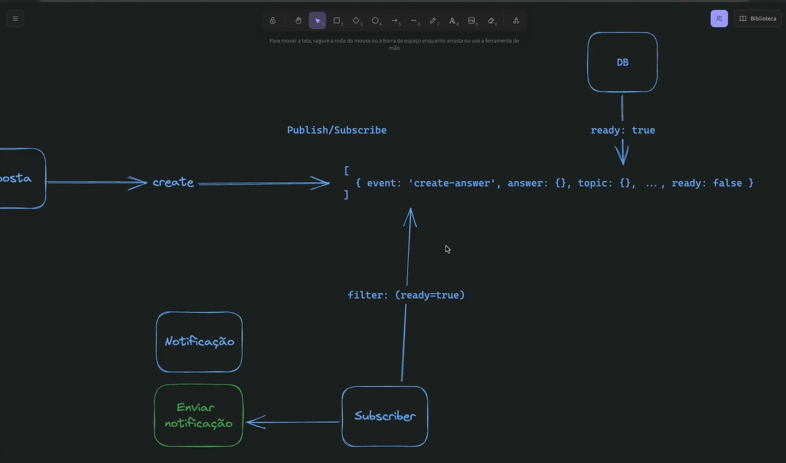

- Eu tenho que responder os alunos e eu me perco em quais dúvidas já foram respondidas

# instructor - use-case - students

- Entidades traduzem tudo que for mantido na aplicação - não precisa ser tablelas no banco - podem compor uma tabela

- implementada a interface de contrato da classe AnswersRepository, que é uma dependência externa da camada de persistência. Isso permitirá que a classe de caso de uso possa utilizá-la sem depender diretamente da implementação concreta da classe.

-Ha propriedades da entidade que podem ser consideradas entidades separadas que posuem funcionamento isoladas, no DDD a gente chama de value objec, ou seja, são valores são propriedades das nossas entidades que possuem regras de negócio associadas a essas propriedades e essas regras podem ser formatações validações, funcionamentos que eu quero restringir dentro daquela propriedade

- **Refatoração das Entidades com uma Classe Base (`Entity`)**

  As entidades de domínio (`Answer`, `Question`, `Student`, etc.) foram refatoradas para estender uma classe base genérica `Entity`.

  **Motivos para a mudança:**
  1.  **Centralização da Lógica de ID:** A criação e o gerenciamento de IDs únicos agora são feitos pela classe `Entity`, evitando duplicação de código.
  2.  **Encapsulamento:** As propriedades de cada entidade são agrupadas em um objeto `props` protegido, permitindo um controle de acesso mais rígido através de getters e métodos. Isso protege as regras de negócio da entidade.
  3.  **Manutenibilidade:** A lógica comum fica em um só lugar. Futuras alterações na gestão de IDs, por exemplo, só precisam ser feitas na classe `Entity`.

  

  Quando a gente fala sobre Design Software ou DDD, Domain Driven Design, isso é especificamente em como a gente vai converter um problema da vida real em um pedaço de software, em um projeto, uma aplicação. Enquanto DDD não tem nada a ver com como a gente vai implementar a nossa aplicação, a arquitetura de software tem totalmente relação em como a gente vai implementar o código da nossa aplicação.

  É claro que Clean Architecture não toca nas tecnologias necessariamente que a gente vai utilizar, então a gente pode implementar Clean Architecture utilizando qualquer linguagem, qualquer framework, qualquer banco de dados, nada disso está estipulado dentro da Clean Architecture. Qual é o principal ponto da arquitetura limpa? Quando a gente fala sobre arquitetura limpa, a gente fala sobre o principal termo que rege a arquitetura limpa, que é desacoplamento.

  Desacoplamento nada mais é do que fazer com que cada parte do nosso código não esteja totalmente acoplada a alguma camada externa ou o que a gente vai ver daqui a pouco que é a camada principalmente a camada de infraestrutura. Se eu for aqui no Google rapidamente e procurar por exemplo.

  A gente está usando a arquitetura limpa, que tem totalmente a ver com a implementação do código, e a gente está utilizando o DDD, que também acaba acionando algumas nomenclaturas específicas dentro do código. Então, o que eu vou fazer?

  ***
  - Entidades e casos de uso fazem parte do domínio. Então, como a gente já colocou aqui dentro de domínio entidades e casos de uso
  - Subdomínios são quase que setores do problema que a gente está resolvendo e que geralmente são divididos dentro do código.
  - subdomínios dentro do conceito de DDD é uma ótima forma da gente enxergar as fronteiras entre, por exemplo, microserviços, caso a gente esteja desenvolvendo uma aplicação que vá utilizar essa arquitetura de microserviços.
  - O meu primeiro subdomínio, que é o subdomínio de fórum, a gente vai agora separar da seguinte forma eu vou criar aqui uma pasta application e uma pasta

  ```
  src/
  ├── core/ # compartilhar código que pode ser usado em vários locais da aplicação.
  │   ├── entities/
  │   └── types/
  ├── domain/                     # Dominios
  │   ├── forum/         # Sundominio -
  │   │   ├── Application/ # Camada vermelha - Application Business Rules
  │   │   │   ├── repositories/
  │   │   │   └── use-cases/
  │   │   └── Enterprise/ # Camada amarela, que é a Enterprise Business
  │   │         └── entities/
  │   │                   └── value-objects/ # são propriedades das nossas entidades que possuem regras de negócio associadas a essas propriedades.
  ```
---
# Faker
  ```
  npm i @faker-js/faker -D
  ```
  ---
  
  ## O que é o override?
  
  O override é um parâmetro que permite sobrescrever (substituir) as propriedades padrão de um objeto quando você está criando uma instância.
  
  Tipos importantes:
  * Partial<QuestionProps>: Significa que override pode conter algumas ou todas as propriedades de QuestionProps
  * = {}: Valor padrão é um objeto vazio (nenhuma sobrescrita)

  ## Functional Error Handling
  either.ts
  
  left-failure / Right-sucess
  * Rigth - Correu tudo certo  ✅  
  UI → CTRL → CASO DE USO → REPOSITÓRIO → BANCO DE DADOS
  * left - Deu erro e voltou  ❌  
  UI → CTRL ←→ CASO DE USO → REPOSITÓRIO → BANCO DE DADOS


  ## Aggregate
 conjunto de entidades que são manipuladas ao mesmo tempo e elas juntas compõem algo maior, quando a gente tem duas ou mais entidades que são trabalhadas juntas, para persistir dados no banco ao mesmo tempo
 Todo agregata tem uma entidade raiz"Pai"
  ## Watchedlist
  Watched List, ela é uma lista observada.
  Editar 

  uma classe, que permite a gente ter mais informações sobre itens contidos numa lista. Então, imagina que o WatchedList é um array como qualquer outro, porém cada item dentro desse array não tem apenas os dados do item em si. Tem também informações se aquilo é um item novo é um item que foi removido ou é um item que foi deletado. Para na hora que eu for salvar esta informação no banco de dados, eu saiba exatamente qual operação eu preciso fazer no banco de dados para cada item, para cada situação daquele item. a gente vai começar a trabalhar com relacionamentos

  ---
  # Subdomínios

Os subdomínios de um sistema podem ser classificados em três categorias principais:

- **Core**: O que dá dinheiro  
- **Supporting**: Dá suporte para o core funcionar  
- **Generic**: Você precisa, mas não são tão importantes  

## Exemplos

### Core
- Compra  
- Catálogo  
- Pagamento  
- Entrega  

### Supporting
- Estoque  

### Generic
- Notificação ao cliente  
- Promoções  
- Chat  
---

#  Fluxo de Domain Events

que é uma técnica utilizada para lidar com a comunicação e ações entre domínios na arquitetura de software. Vamos entender como os eventos de domínio são gerados, propagados e consumidos, permitindo uma comunicação assíncrona e desacoplada entre diferentes partes da aplicação 

Essa estrutura garante uma ortogonalidade,
Se é preciso disparar um evento sempre que for criado uma resposta, então separamos essa lojica, no metodo create eu crio um objto com dados e adiciono uma classe para escutar eventos, como eu preciso garantir a atomicidade dos dados então, quando o evento for salvo no banco eu altero um status dos dados para garantir essa atomicidade

## Fluxo
 O evento é criado, armazenado no agregado, e quando é despachado no repositório. Abaixo está o fluxo completo passo a passo, com os pontos de entrada e execução do handler.

### Fluxo completo (fim-a-fim)

1) Criação do evento no agregado
- **Quando** uma `Answer` é criada e identificada como nova, o agregado adiciona o evento de domínio.
```74:76:/home/elvis/devspace/rocketseat/src/domain/forum/enterprise/entities/answer.ts
    if (isNewAnswer) {
      answer.addDomainEvent(new AnswerCreatedEvent(answer))
    }
```

2) Armazenar o evento e marcar o agregado para dispatch
- `addDomainEvent` guarda o evento na lista interna do agregado e marca o agregado para futura publicação.
```12:15:/home/elvis/devspace/rocketseat/src/core/entities/aggregate-root.ts
  protected addDomainEvent(domainEvent: DomainEvent): void {
    this._domainEvents.push(domainEvent)
    DomainEvents.markAggregateForDispatch(this)
  }
```

3) Repositório persiste e dispara os eventos do agregado
- Após `create`/`save`, o repositório chama o dispatch para o agregado recém-persistido.
```42:46:/home/elvis/devspace/rocketseat/test/repositories/in-memory-answers-repository.ts
  async create(answer: Answer): Promise<void> {
    this.items.push(answer)

    DomainEvents.dispatchEventsForAggregate(answer.id)
  }
```
- O mecanismo de eventos encontra o agregado marcado, despacha todos os seus eventos e limpa a fila.
```37:45:/home/elvis/devspace/rocketseat/src/core/events/domain-events.ts
  public static dispatchEventsForAggregate(id: UniqueEntityId) {
    const aggregate = this.findMarkedAggregateByID(id)

    if (aggregate) {
      this.dispatchAggregateEvents(aggregate)
      aggregate.clearEvents()
      this.removeAggregateFromMarkedDispatchList(aggregate)
    }
  }
```

4) Dispatcher resolve handlers registrados por nome do evento
- O dispatcher identifica handlers registrados com o nome da classe do evento e os executa.
```68:79:/home/elvis/devspace/rocketseat/src/core/events/domain-events.ts
  private static dispatch(event: DomainEvent) {
    const eventClassName: string = event.constructor.name

    const isEventRegistered = eventClassName in this.handlersMap

    if (isEventRegistered) {
      const handlers = this.handlersMap[eventClassName]

      for (const handler of handlers) {
        handler(event)
      }
    }
  }
```

5) Definição do evento de domínio
- O evento carrega a `answer` e o `ocurredAt`, e expõe o `getAggregateId`.
```5:16:/home/elvis/devspace/rocketseat/src/domain/forum/enterprise/events/answer-created-event.ts
export class AnswerCreatedEvent implements DomainEvent {
  public ocurredAt: Date
  public answer: Answer

  constructor(answer: Answer) {
    this.answer = answer
    this.ocurredAt = new Date()
  }

  getAggregateId(): UniqueEntityId {
    return this.answer.id
  }
}
```

6) Registro da assinatura (listener) do evento
- Ao instanciar o subscriber, ele se registra para escutar `AnswerCreatedEvent` no barramento.
```15:19:/home/elvis/devspace/rocketseat/src/domain/notification/subscribers/on-answer-created.ts
  setupSubscriptions(): void {
    DomainEvents.register(
      this.sendNewAnswerNotification.bind(this),
      AnswerCreatedEvent.name,
    )
  }
```

7) Execução do handler: carregar dados e disparar caso de uso
- O handler busca a `Question` da `Answer`, e dispara o `SendNotificationUseCase`.
```22:31:/home/elvis/devspace/rocketseat/src/domain/notification/subscribers/on-answer-created.ts
  private async sendNewAnswerNotification({ answer }: AnswerCreatedEvent) {
    const question = await this.quesTionsRepository.findById(
      answer.questionId.toString(),
    )
    if (question) {
      await this.sendNotification.execute({
        recipientId: question.authorId.toString(),
        title: `Nova resposta em "${question.title.substring(0, 40).concat('...')}"`,
        content: answer.excerpt,
      })
    }
  }
```

8) Resultado
- O autor da pergunta recebe uma notificação com título e trecho da resposta, logo após o repositório persistir a `Answer` e o domínio despachar os eventos.

Resumo
- Evento criado: `AnswerCreatedEvent` é adicionado à `Answer` via `addDomainEvent`.
- Agendado para dispatch: agregado marcado em `DomainEvents.markAggregateForDispatch`.
- Despacho: repositório chama `DomainEvents.dispatchEventsForAggregate(answer.id)` após persistência.
- Listener: `OnAnswerCreated` registrado com `AnswerCreatedEvent.name`, busca `Question` e envia notificação via `SendNotificationUseCase`.

---
### Uso do bind()
Então, isso aqui é um hackzinho que a gente usa no JavaScript desde muito tempo, que é usar o bind. O bind aqui funciona da seguinte forma, eu estou falando que quando essa função for chamada, Dentro dela, o this tem que significar o mesmo this deste momento aqui que eu estou passando pra ela. Ou seja, o this nesse caso aqui é esta classe. Ou seja, não importa quando essa função for chamada, o this dela sempre vai ser a referência pra essa classe. Só que é importante porque...

add Answer-comments e Question-comments
